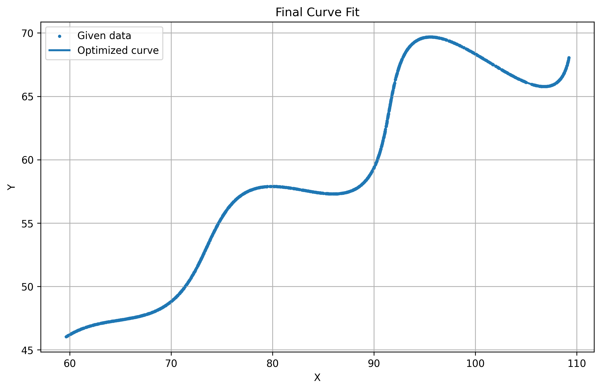

# FlamAI R&D Assignment

## Overview

This project solves the given XY-data curve fitting problem by estimating the parameters of a parametric curve.

The objective is to find curve parameters that provide a close fit to the supplied XY data while minimizing the L1 distance.

## Dataset

The supplied dataset contains 1500 XY coordinate points.

- `x` — X coordinate
- `y` — Y coordinate

The dataset is provided in `xy_data.csv`.

## Methodology

The solution follows these steps:

1. Load the supplied XY dataset.
2. Define the parametric curve using the parameters Theta, M, and X.
3. Generate points along the calculated curve.
4. Calculate the L1 distance between the given data points and the nearest points on the calculated curve.
5. Use constrained optimization to estimate the parameters.
6. Generate the final optimized curve.
7. Compare the optimized curve with the original data.

## Optimization

Differential Evolution is used to search for parameter values that minimize the L1 distance.

The optimized parameters obtained are approximately:

| Parameter | Value |
|---|---:|
| Theta | 30.000004 degrees |
| M | 0.030001 |
| X | 54.999999 |

Final L1 distance:

`10.371582`

## Result

The optimized curve closely follows the supplied XY data.



## Files

| File | Description |
|---|---|
| `solution.py` | Python implementation of the curve fitting and optimization |
| `xy_data.csv` | Supplied XY dataset |
| `curve_fit.png` | Final visualization of the fitted curve |

## Requirements

The solution uses:

- NumPy
- Pandas
- Matplotlib
- SciPy

## How to Run

Place `solution.py` and `xy_data.csv` in the same directory and run:

```bash
python solution.py
